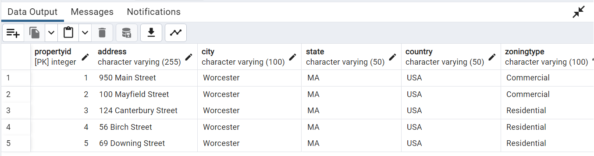
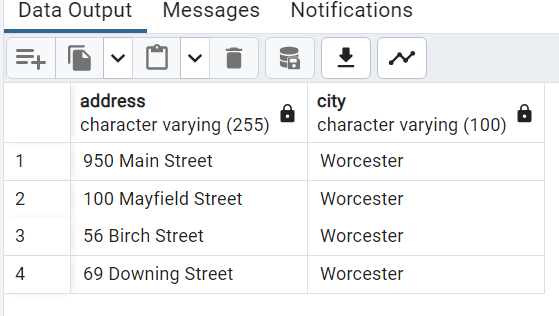
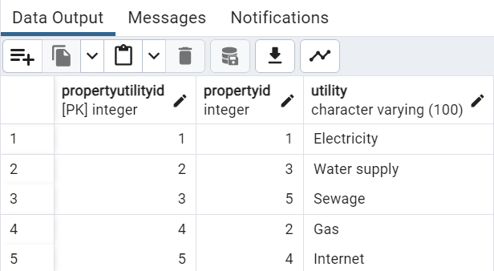
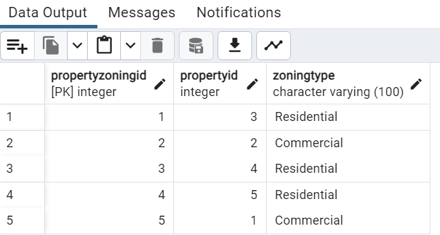

# Assignment 3 - Normalizing Spatial Data in a Real Estate Database

## Part 1: Introduction
Database Normalization is a methodical strategy for arranging data within a database with the aim of minimizing repetition and enhancing data integrity.

## Objectives
This assignment will help guide through the process of creating and normalizing a relational database up to the third and fourth normal forms (3NF and 4NF)using PostgreSQL with the PostGIS extension.It involves the following tasks;
-Creating an initial table structure for storing property details.
-Progressively normalizing the table structure to achieve Third Normal Form (3NF) and Fourth Normal Form (4NF).
-Utilizing PostgreSQL as the database management system.
-Implementing the PostGIS extension in PostgreSQL for handling spatial data.

*italic*.Understanding and applying the principles of 3NF and 4NF  is essential in creating well-structured, efficient, and reliable relational databases. They provide a systematic approach to organizing data, which leads to better performance, easier maintenance, and increased data quality*italic*.

### Importance of 3NF
- It helps eliminate transitive dependency from a database table that can lead to storage inefficiencies and increase the risk of inconsistencies.
-3NF is important for maintaining a well-defined and efficient database that ensures data accuracy, reduces redundancy, and supports seamless adaptability to changes in the system's requirements

### Importance of 3NF
- 4NF is crucial because it takes normalization a step further by addressing multi-valued dependencies that often lead to data redundancy. Addressing this multi-valued will lead to more efficient use of storage space.
-Normalizing database to 4NF can enhance data integrity, ensuring that the data in the database remains accurate and reliable.

### Code Block used for this assignment.
`CREATE EXTENSION postgis;`
_This including this query at the start of sql script helps to set up one’s database to work with spatial data through the PostGIS extension_.

_Create an initial PropertyDetails table that intentionally violates normalization principles_
`CREATE TABLE PropertyDetails (  --  How to create a table
    PropertyID SERIAL PRIMARY KEY,  -- SERIAL = datatype for unique ID (it indicates that it is being controlled the database)
    City VARCHAR(100),               -- VARCHAR = datatype, useful for names, descriptions etc
    State VARCHAR(50),
    Country VARCHAR(50),             -- VARCHAR = datatype, useful for names, descriptions etc
    ZoningType VARCHAR(100),         -- VARCHAR = datatype, useful for names, descriptions etc
    Utility VARCHAR(100),
    GeoLocation GEOMETRY(Point, 4326), -- Spatial data type
    CityPopulation INT                 -- INTEGER, type of datatype
);`
_This query was used for creating PropertyDetails table (initial table)_.

_The following Queries are for inserting data into PropertyDetails table_.

`INSERT INTO PropertyDetails 
(Address, City, State, Country, ZoningType, Utility, GeoLocation, CityPopulation)
VALUES
('950 Main Street', 'Worcester', 'MA', 'USA', 'Commercial', 'Electricity', 
 ST_GeomFromText('POINT(42.2504899 -71.827456)', 4326), 
 103872)
;`

`INSERT INTO PropertyDetails 
(Address, City, State, Country, ZoningType, Utility, GeoLocation, CityPopulation)
VALUES
('100 Mayfield Street', 'Worcester', 'MA', 'USA', 'Commercial', 'Gas', 
 ST_GeomFromText('POINT(42.2504899 -71.827456)', 4326), 
 103872)
;`

`INSERT INTO PropertyDetails 
(Address, City, State, Country, ZoningType, Utility, GeoLocation, CityPopulation)
VALUES
('124 Canterbury Street', 'Worcester', 'MA', 'USA', 'Residential', 'Water supply', 
 ST_GeomFromText('POINT(42.2469458 -71.8177652)', 4326), 
 103872)
;`

`INSERT INTO PropertyDetails 
(Address, City, State, Country, ZoningType, Utility, GeoLocation, CityPopulation)
VALUES
('56 Birch Street', 'Worcester', 'MA', 'USA', 'Residential', 'Internet', 
 ST_GeomFromText('POINT(42.2514315 -71.8287747)', 4326), 
 103872)
;'

`INSERT INTO PropertyDetails 
(Address, City, State, Country, ZoningType, Utility, GeoLocation, CityPopulation)
VALUES
('69 Downing Street', 'Worcester', 'MA', 'USA', 'Residential', 'Sewage', 
 ST_GeomFromText('POINT(42.2532199 -71.8244847)', 4326), 
 103872)
;`

_Normalizing to 3NF_.

_Creating CityDemographics Table_.  
`CREATE TABLE CityDemographics (    --  How to create a table
    City VARCHAR(100) PRIMARY KEY, -- VARCHAR = datatype, useful for names, descriptions etc
    State VARCHAR(50),             -- VARCHAR = datatype, useful for names, descriptions etc
    Country VARCHAR(50),           -- VARCHAR = datatype, useful for names, descriptions etc
    CityPopulation INT             - INTEGER, type of datatype
);`

_Query for inserting data into CityDemographics Table_.
`SELECT DISTINCT City, State, Country, CityPopulation FROM PropertyDetails;` ---Verification Command

`INSERT INTO CityDemographics (City, State, Country, CityPopulation) -- Final Inertion Command
SELECT DISTINCT City, State, Country, CityPopulation FROM PropertyDetails;`

_Modify PropertyDetails Table:This is to reduce duplicating the data_.
`ALTER TABLE PropertyDetails DROP COLUMN CityPopulation, DROP COLUMN State, DROP COLUMN Country;`

_Normalizing to 4NF_.
_Create PropertyZoning and PropertyUtilities Tables_.

_Query for Creating PropertyZoning Table_.
`CREATE TABLE PropertyZoning (
    PropertyZoningID SERIAL PRIMARY KEY,  -- SERIAL = datatype for unique ID (it indicates that it is being controlled the database)
    PropertyID INT REFERENCES PropertyDetails(PropertyID),
    ZoningType VARCHAR(100)
);`
_This query was used for creating PropertyZoning Table_.

_Query for Creating PropertyUtilities Table_.
`CREATE TABLE PropertyUtilities (
    PropertyUtilityID SERIAL PRIMARY KEY,  -- SERIAL = datatype for unique ID (it indicates that it is being controlled the database)
    PropertyID INT REFERENCES PropertyDetails(PropertyID),
    Utility VARCHAR(100)
);`
_This query was used for creating PropertyUtilities Table_.

_Populate both the PropertyZoning and PropertyUtilities Tables_.

_ Query for inserting data into PropertyZoning Table_.
`SELECT DISTINCT PropertyID, ZoningType FROM PropertyDetails;` ---Verification Command

`INSERT INTO PropertyZoning (PropertyID, ZoningType) -- Final Inertion Command
SELECT DISTINCT PropertyID, ZoningType FROM PropertyDetails;`

DELETE FROM PropertyZoning -- Query to delete table (especially when the table is dublicated)

_Query for inserting data into PropertyUtilities Table_.
`SELECT DISTINCT PropertyID, Utility FROM PropertyDetails;` ---Verification Command

`INSERT INTO PropertyUtilities (PropertyID, Utility) -- Final Inertion Command
SELECT DISTINCT PropertyID, Utility FROM PropertyDetails;`

_Remove Columns from PropertyDetails_.
`ALTER TABLE PropertyDetails DROP COLUMN ZoningType, DROP COLUMN Utility;`
_Querying for removing columns from PropertyDetails_.
_By separating ZoningType and Utility into their tables, we eliminate multi-valued dependencies in PropertyDetails_.

_Spatial Data Manipulation_.
_Inserting and querying spatial data using PostGIS_.

_Insert a Property with Geolocation_. -- I accidentally inserting existing data into the PropertyDetails table
`INSERT INTO PropertyDetails (Address, City, GeoLocation) VALUES 
('950 Main St', 'Worcester', ST_GeomFromText('POINT(42.2504899 -71.827456)', 4326));`

_Querying for deleting the additional data in the PropertyDetails_.
`DELETE FROM PropertyDetails WHERE PropertyID = 6` -- I used this query to delete the data

_Query Properties within a Radius_.
`SELECT Address, City
FROM PropertyDetails
WHERE ST_DWithin(
    GeoLocation,
    ST_GeomFromText('POINT(42.2504899 -71.827456)', 4326),
    0.01 -- Spatial Distance 0.01
);`
_This query is used to find properties within a certain radius of the given location_.

### Uploading Images

_table.PNG)

![This is the screenshot of ModifiedPropertydetails2 table(Images/ModifiedProperydetails2_table.PNG)

### Challenges Encountered
-Due to frequent modification to the initial table created which also often require adjustments across the other tables created, this adaptability was challenging for me to manage effectively. 

-I faced difficulties capturing screenshots of my Propertydetails table to update my image file after making some changes to the table. Even after dropping the table, I still encountered issues, which prevented me from retrieving the initial details of the table. Consequently, I decided to delete the entire database, create a new one, and then re-run the queries to finally obtain the Propertydetails table.

-Part of my challenge was also mistakenly writing queries that added exiting information to the Propertydetails table thereby leading to duplication of information.

### Solution
-To this challenge, I resolved to taking snapshots of the database before making changes, I can revert to the snapshot to retrieve the initial details thereby providing accurate and up-to-date visuals.

-I learned from every challenge I went through during this assignment; I focused on understanding the challenges and how the modifications of the tables affect each table and data generated which made my work less overwhelming.

-I learned a new way of deleting extra information from a table when information is duplicated through the help of the TA.

## Conclusion
This assignment focuses on providing guidinance to the process of creating and normalizing a relational database up to the Third Normal Form (3NF) and Fourth Normal Form (4NF) using PostgreSQL with the PostGIS extension which involved progressively normalizing the structure, utilizing PostgreSQL as the database management system, and implementing the PostGIS extension for spatial data. By addressing transitive dependencies and multi-valued dependencies associated with data, the assignment aims to eliminate data redundancy, enhance data integrity, and promote efficiency in storage space utilization. Ultimately, the goal is to create a well-defined, efficient, and adaptable database that ensures data accuracy and reliability.

